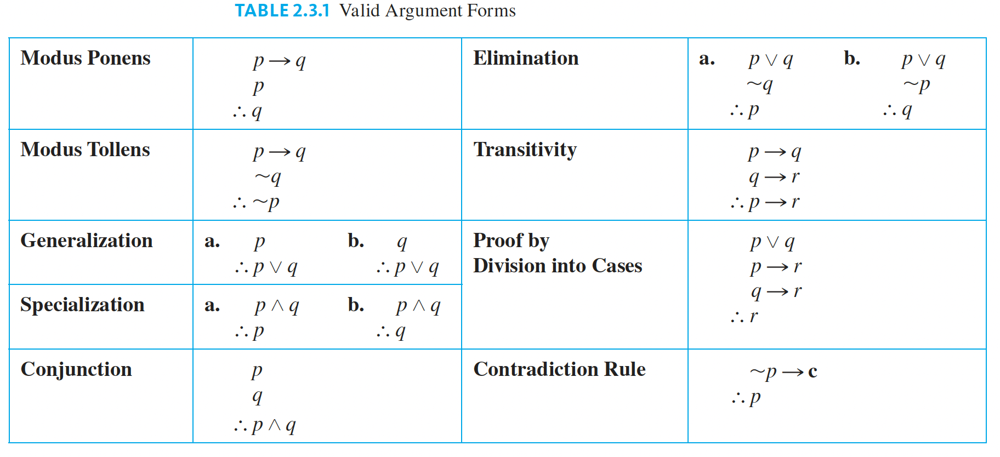

# Valid and Invalid arguments (Rules of Inference)

To say that an argument form is valid means that no matter what particular statements are substituted for the statement
variables in its premises, if the resulting premises are all true, then the conclusion is also true. To say that an 
argument is valid means that its form is valid.

## Testing an argument form of validity

 - Identify the premises and conclusion of the argument form
 - Contruct a truth table showing truth values of all premises and the conclusion
 - A row of the truth table in which all the premises are true is called a critical row.
    If the conclusion in every critical row is true, then the argument is valid else invalid

## Syllogism

An argument form consisting of two premises and a conclusion is called a syllogism.
The first and second premises are called the major premise and minor premise.

## Fallacies

A fallacy is an error in reasoning that results in an invalid argument. Some common fallacies are:

- Ambiguous premises : Using ambiguous premises
- Circular reasoning : Assuming what is to be proved without having derieved it from premises
- Jumping to a conclusion : Jumping to a conclusion without adequate grounds.
- Converse error : This fallacy is also known as affirming the consequent. 
    P → Q  
    Q  
    ∴ P  (Incorrect inference)

- Inverse error : This fallacy is also known as denying the antecedent. 
    P → Q 
    ¬P 
    ∴ ¬Q  (Incorrect inference)
